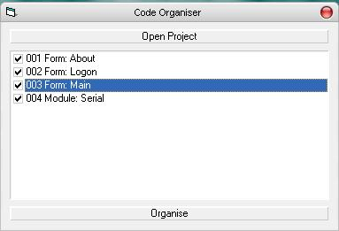



## Code Organiser

### Description

Code Organiser "beautifies" your code, i.e. automatically indents it properly. You tell it which project to organise, and it will allow you to select which forms, modules or classes to modify. Extremely useful for making code much more readable.
 
### More Info
 

             |
---                |---
**Submitted On**   |2003-09-23 15:13:00
**By**             |[Craig Bonathan](https://github.com/Planet-Source-Code/PSCIndex/blob/master/ByAuthor/craig-bonathan.md)
**Level**          |Intermediate
**User Rating**    |4.6 (41 globes from 9 users)
**Compatibility**  |VB 6\.0
**Category**       |[Miscellaneous](https://github.com/Planet-Source-Code/PSCIndex/blob/master/ByCategory/miscellaneous__1-1.md)
**World**          |[Visual Basic](https://github.com/Planet-Source-Code/PSCIndex/blob/master/ByWorld/visual-basic.md)
**Archive File**   |[Code\_Organ18202811202004\.zip](https://github.com/Planet-Source-Code/craig-bonathan-code-organiser__1-57341/archive/master.zip)

